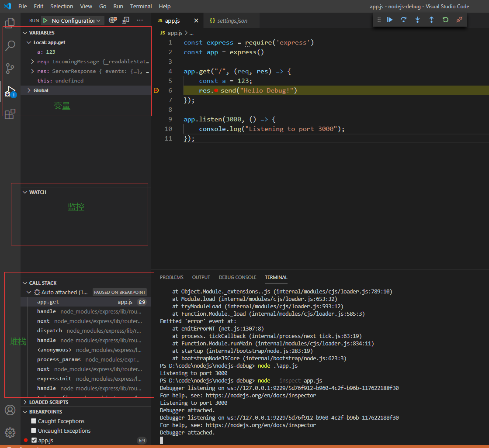

<h1 align = "center"> node.js调试入门 </h1>

https://www.imooc.com/learn/1093

## 1、Inspector的介绍

使用inspector调试nodejs的优势：

- 可查看当前上下文的变量
- 可观察当前函数调用堆栈
- 不入侵代码
- 可在在那听状态下执行指定的代码

## 2、Inspector的构成以及原理

- WebSockets服务（监听命令）
- Inspector协议
- HTTP服务（获取元信息）

## 3、激活调试

- 如何激活调试？

  ```BASH
  node --inspect app.js
  ```

  如果只是简单的程序，在激活调试之前就瞬间执行程序完毕，是看不到效果的，需要程序一直在运行。因此下面的例子引入express框架，运行HTTP服务的程序。

- 激活调试后会发生什么？

  - Node进程通过WebSockets监听调试信息
  - 启动一个HTTP服务，提供元信息

  ```
  Debugger listening on ws://127.0.0.1:9229/aec8999d-c244-4d55-9efa-f1223c0eb55c
  For help, see: https://nodejs.org/en/docs/inspector
  Listening to port 3000
  Debugger attached.
  ```

  > ws://127.0.0.1:9229/aec8999d-c244-4d55-9efa-f1223c0eb55c 是WebSockets
  >
  > 在浏览器访问 127.0.0.1:9229/json 就能看到HTTP服务提供的元信息

- 如何调试没有激活的nodejs代码？

  在Linux和OSX系统上，可以监听到SIGUSR1发送的调试信息，不用inspect

## 4、调试客户端

- 调试客户端是什么？

  连接到nodejs Inspector的工具

- 调试客户端有哪些？

  - Chrome DevTools 55+
  - VS Code
  - 其他

## 5、VS Code

### 5.1 启动方式

- F5

  F5适合非常简单的程序，通常只有一个文件，直接`node app.js` 运行

- 配置lauch.json

  在json文件中，可以指定运行的文件，以及添加运行参数

- 配置auto attach

  ctrl + shift + p，搜索auto attach，设置开启，在终端运行`node --inspect app.js` 指令

### 5.2 配置launch.json

- ctrl + shift + D 进入debug面板，添加配置，选择 Node.js，会自动生成launch.json

- 编辑launch.json

  ```json
  {
      "version": "0.2.0",
      "configurations": [
          
          {
              "type": "node",
              "request": "launch",
              "name": "NodeJS debug",
              "skipFiles": [
                  "<node_internals>/**"
              ],
              "program": "${workspaceFolder}\\cmd.js",
              "args": ["init"]
          }
      ]
  }
  ```

  上面的配置，相当于执行`node cmd.js init`

- 在cmd.js 的`console.log(arg); `处打断点，然后左上角点击绿色箭头执行

  ```js
  //cmd.js
  const arg = process.argv[2];
  console.log(arg);
  ```

### 5.3 调试实例

- 使用Git Bash创建nodejs-debug目录

  ```bash
  mkdir nodejs-debug
  ```

- Git Bash调用VS Code 打开目录

  ```bash
  code nodejs-debug/
  ```

- 使用VS Code在nodejs-debug项目中添加app.js文件

- 初始化项目

  ```bash
  npm init -y
  ```

- 导入Express框架

  ```bash
  npm install express --save
  ```

- 编辑app.js

  ```js
  const express = require('express')
  const app = express()
  
  app.get("/", (req, res) => {
      const a = 123;
      res.send("Hello Debug!") //打断点
  });
  
  app.listen(3000, () => {
      console.log("Listening to port 3000");
  });
  ```

- ctrl + shift + p，搜索auto attach，点击搜索结果第一项：`debug:Toggle auto attach `，项目就会生成settings.json:

  ```json
  {
      "debug.node.autoAttach": "on"
  }
  ```

- 在app.js的`res.send("Hello Debug!")`处打断点，终端运行

  ```bash
  node --inspect app.js
  ```

- 浏览器访问 http://localhost:3000/

- VS Code可看到

  